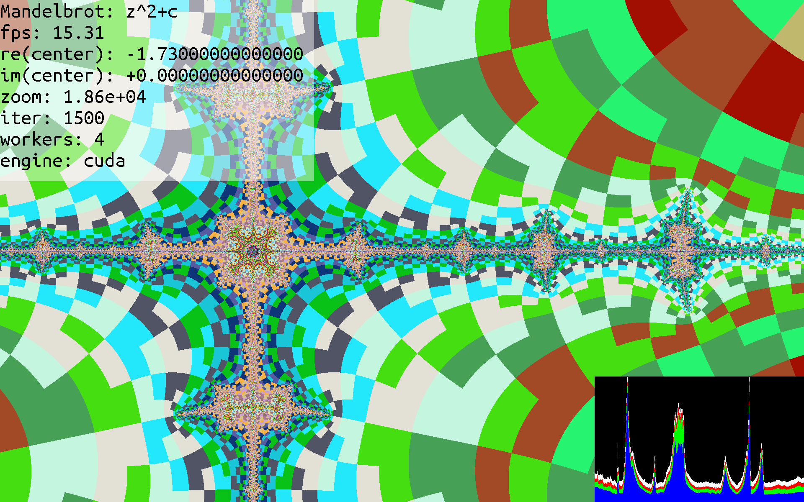

# fractalexplorer

This is a repository for simulation and interactive program to be ran on leconte

## Requirements

Currently, this is only known to work on MacOS, Linux, either my personal desktop, or a Jetson TX2 (which is what leconte uses).

You need:

  * C compiler for MPI (`mpicc`) (use environment variable `MPICC` to set this)
  * MPI libraries
  * SDL2 and SDL2_ttf
  * LZ4 (you need a specific version, use [this tarball](https://github.com/lz4/lz4/archive/v1.7.5.tar.gz))

Optionally, the following are supported:

 * CUDA (use --with-cuda to specify)

### MacOS

`brew install sdl2 sdl2_ttf open-mpi lz4`

## On leconte

This is for setting up the project on a physical build of leconte.

First, you will need to set up [our ansible configuration](https://github.com/ornl-leconte/ansible-management) on the cluster.

Either download a release tarball, or clone the development branch. (you can do this anywhere on the filesystem).

Now, run `./configure --prefix=/leconte/shared` assure this runs with no errors.

Run `make` and assure there are no errors during compilation, then run `make install`

This should install binaries to the correct places that our ansible-installed scripts are looking for.

Now, to test, run `/leconte/startup.sh` you should have a fullscreen application running in about 5-6 seconds max.

## Building

### From Release Tarball

To build, run:

`./configure && make`

to build without CUDA support, run:

`./configure --without-cuda`

The resulting binary is `./src/fractalexplorer`, and must be ran with `mpirun`

### From Repository

First, install GNU Autotools for your platform. Then, run `autoreconf -i`

Now, you can run `./configure && make` just like **From Release Tarball**.

## Installing

Install scripts for required software are provided for macOS and ubuntu, they should be ran like: `./install_macos.sh` or `./install_ubuntu.sh` respectively.

## Running

To run, use `mpirun`:

`mpirun -n 1 ./src/fractalexplorer -h`

to view help.

Run `mpirun -n 6 ./src/fractalexplorer -i250 -crandom -F` to do a fullscreen render.

You will need at least 2 threads (1 head and 1 compute), but you can add as many as you'd like.

TODO: Add multi-machine example

### Controls

#### Keyboard

Keyboard arrows pan, space zooms in, and shift+space zooms out.

`p` increases iteration, `o` decreases

`a` and `s` change the engine (c or CUDA)

`k` increases number of nodes working on image, `j` decreases

`m` and `n` navigate through the fractal types

`z` toggles simple or gradient coloring

`x` toggles binary decomposition on the real component of z_n

`c` toggles binary decomposition on the imaginary component of z_n`

`esc` or `q` quit the program gracefully

`e` exits with a non-zero return code (123)

#### Controller

You need to change macros in `src/render.c`, that start with `CONTROLLER_`.
 
The current CONTROLLER_ macros are valid for the Logitech F310

Current controls:

Left/Right triggers: zooms in and out

Left/Right bumpers: decreases and increases the number of workers

DPad Left and Right: Switches between types of fractals

DPad Up and Down: Increase and decrease the number of iterations

Left joystick: Pans in the complex plane

Right joystick: Changes the `q` variable in the complex plane

X button: toggles smooth shading

Y button: toggles binary decomposition on imaginary component

B button: toggles binary decomposition on real component

A button: toggles 'theatric mode', which disables the overlay and graph

Back button (aka select button): switch between computing with C and CUDA engines

## Bundling

To distribute source, run `make dist-gzip` (or `make dist-zip`), you should have `fractalexplorer-VERSION.tar.gz` (or `fractalexplorer-VERSION.zip`).

This is what is included on the [releases](http://github.com/ornl-leconte/fractalexplorer/releases) page.

It includes `configure`, so you don't need autotools to install the program once untarred/unzipped; just use `./configure && make`

## FAQS/Common Problems

Q: During compilation, the compiler complains that `LZ4_compress_default` is undefined/unresolved. How to fix?

A: You either haven't installed LZ4, or have an improper version (even Ubuntu repositories carry old versions). Install using [this tarball](https://github.com/lz4/lz4/archive/v1.7.5.tar.gz).

Q: The program compiles fine, but when running, it gives an error that a library can't be found (like `cannot find liblz4.so.1`).

A: Set `LD_LIBRARY_PATH` to include any locations where required libraries are found. This should include `/usr/lib` and `/usr/local/lib`

Q: I'm getting an error that wasn't listed in this section, how do I troubleshoot?

A: Use fractalexplorer's verbose setting: add `-v5` to the argument list when running, and much more info will be printed. Paste the entire program log with `-v5` to [hastebin](https://hastebin.com/) or a similar site, and open up an [issue](https://github.com/ornl-leconte/fractalexplorer/issues/new), describe your problem and link the program output.

